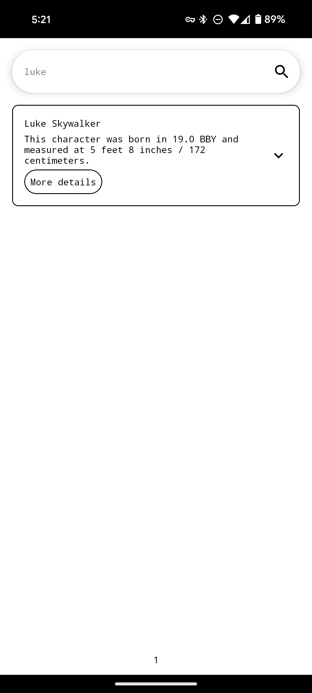

Star Wars Sample App
====================

## Table of Contents

1. [Architecture Overview](#architecture-overview)
2. [Domain Layer](#domain-layer)
3. [Data Layer](#data-layer)
4. [Presentation Layer](#presentation-layer)
5. [A Quick Note on Testing](#a-quick-note-on-testing)
6. [A Quick Note on Dependency Injection](#a-quick-note-on-dependency-injection)
7. [Screenshots](#screenshots)

## Architecture Overview

The application is heavily based
on [Clean Architecture](https://blog.cleancoder.com/uncle-bob/2012/08/13/the-clean-architecture.html)
principles by Robert C. Martin (Uncle Bob) alongside
the [official guidance](https://developer.android.com/topic/architecture) by the Android team. A key
point to note is that the domain layer is independent of the presentation and data layers. This
contradicts the official guidance where the domain layer is optional and it depends on the data
layer. Aside from this, all
other [Modern App Development](https://developer.android.com/topic/architecture#modern-app-architecture)
principles are followed.


Why pick clean architecture? Since domain modules are fully decoupled from the data and presentation
layers, they are both allowed to be implemented independently. Data sourcing is an implementation
detail, this application could have used another API to fetch Star Wars data and/or another database
for storage. By keeping business rules at the foundation of the application, it prevents other
layers from affecting the thinking of business rules.

We end up with something like this:


## Domain Layer

This layer is broken down into core modules. I decided that each Star Wars concept merited a module
of its own for scalability and clarity. This also matches SWAPI calls which are separated by similar
models. Each module is kept to a bare minimum and defines one `Repository` `interface` alongside
some models.

* `:characterCore`
* `:planetCore`
* `:filmCore`
* `:speciesCore`
* `:core` (shared)

I think its important to note that any domain module could easily be translated into another
platform such as web or iOS. Policies in the domain layer are high level and depend on programming
paradigms such as reactive and functional programming. Below is an example which returns a reactive
stream of a immutable list of immutable data.

```kotlin
fun fetchFilms(
    ids: ImmutableList<Long>
): Flow<Response<ImmutableList<Film>>>
```

### Dependencies

* `kotlinx-collections-immutable` for access to immutable data types such as `ImmutableList`.
  Collections are the major source of issues when it comes to functional reactive programming in my
  opinion so I consider this library essential.
* `kotlinx-coroutines` for access to `Flow` reactive streams.

All core modules share dependencies using `api()` in the build script allowing access to all these
constructs without extra management.

### `:core`

Shared resources can be accessed via the `:core` module. A critical model found here is `Response`
which is the return type for all core operations. As seen in the example above `fetchFilms` returns
a `Flow<Response<ImmutableList<Film>>>`.

* `Response<out T>`
    * `ResponseWithData<out T>`
        * `Success<out T>`
        * `Backup<out T>`
    * `ResponseWithoutData<Nothing>`
        * `Failure<Nothing>`
        * `Loading<Nothing>`

Wrapping responses really simplifies reasoning in the layers above where flow mappings can easily be
performed with a simple `when` statement. By further breaking down responses into ones with data and
ones without, consumers can be more granular with their logic.

```kotlin
when (response) {
    is Success -> {}
    is Failure -> {}
    Loading -> {}
    is Backup -> {}
}

when (response) {
    is ResponseWithData -> {}
    is ResponseWithoutData -> {}
}

when (responseWithData) {
    is Success -> {}
    is Backup -> {}
}

when (responseWithoutData) {
    is Failure -> {}
    Loading -> {}
}
```

Fun note, by setting response types to `<Nothing>` we can more easily share code since
these responses are not tied to a specific type.

### Other `:xCore` Modules

Below is the package structure of `:filmCore` which is shared among all `:xCore` modules.

* `model`
    * `Film`
* `repository`
    * `FilmRepository`

`Film` is a simple `data class` that is immutable. No `var` fields or collections that are not part
of `kotlinx-collections-immutable`.

```kotlin
data class Film(
    val id: Long,
    val title: String,
    val openingCrawl: String
)
```

`FilmRepository` operations take in immutable data types as params and return `Flow<Response<X>>`
where `X` is usually a immutable collection of models or simply the model.

```kotlin
interface FilmRepository {

    fun fetchFilm(
        id: Long
    ): Flow<Response<Film>>

    fun fetchFilms(
        ids: ImmutableList<Long>
    ): Flow<Response<ImmutableList<Film>>>
}
```

## Data Layer

This layer is made up one single module: `:swapiData`. This module implements
all `Repository` `interfaces` located in the domain layer. The decision to keep everything in one
module was made because I did not want to have multiple databases and remote services running.


Each core module is represented by its own package which is broken down as such:

* `xCore`
    * `local` (package)
    * `remote` (package)
    * `mapper` (package)
    * `xRepositoryImpl` (class)

The `local` package is further broken down below. `xDao` exposes operations to the
corresponding `xEntity` table in the database.

* `local`
    * `model` (package)
        * `xEntity` (class)
    * `xDao` (class)

The `remote` package is further broken down below. `xApi` exposes responses from SWAPI and maps the
needed fields into the corresponding `xDto`.

* `remote`
    * `model` (package)
        * `xDto` (class)
    * `xApi` (class)

The `mapper` package is further broken down below. Mapping functions were extracted to declutter
the `xRepository` and help support scalability.

* `mapper`
    * `xDtoToXEntityMapper.kt` (functions)
    * `xEntityToXMapper.kt` (functions)

`xRepositotyImpl` inherits from the `:xCore`'s `xRepository` and implements a data sourcing strategy
using the corresponding `xDao` and `xApi` classes. Mapping of models is done using the functionality
located in the `mapper` package.

Here is the complete picture:


### Dependencies

* `Retrofit` is used to implement remote data fetching.
* `Room` is used for local storage.

These libraries are widely adopted in the Android community and have great support.

### Data Sourcing Strategy

I adopted a simple strategy which I will explain line by line using the `PlanetRepositoryImpl`.

```kotlin
override fun fetchPlanet(
    id: Long
): Flow<Response<Planet>> = flow {
    emit(Loading)
    try {
        val updatedEntity = syncLocalPlanetAndGet(id)
        emit(Success(transformToPlanet(updatedEntity)))
    } catch (e: IOException) {
        emit(getPlanetResponseOnFailure(id, e))
    } catch (e: HttpException) {
        emit(getPlanetResponseOnFailure(id, e))
    }
}
```

The first step to let the caller know we are loading a response.

```kotlin
emit(Loading)
```

We follow this with a `try-catch` block. Let's break down the `try` section. We first call the
function `syncLocalPlanetAndGet`.

```kotlin
val updatedEntity = syncLocalPlanetAndGet(id)
```

Here is the function:

```kotlin
private suspend fun syncLocalPlanetAndGet(id: Long): PlanetEntity {
    val dto = api.getPlanet(id)
    val entity = transformToPlanetEntity(dto)
    dao.upsert(entity)
    return entity
}
```

It tries to:

1) Fetch data remotely
2) Transform `PlanetDto` to `PlanetEntity`
3) Upsert into the database
4) Return the updated data

If all the steps above are successful then we move to the last line in the `try` section.

```kotlin
emit(Success(transformToPlanet(updatedEntity)))
```

It tries to:

1) Transform the `PlanetEntity` to `Planet` (domain model)
2) Emit `Response.Success` with the data back to the caller

In the case of an `IOException` or `HttpException`, we move to the `catch` section.

```kotlin
emit(getPlanetResponseOnFailure(id, e))
```

The function `getPlanetResponseOnFailure` is called. Here is the function:

```kotlin
private suspend fun getPlanetResponseOnFailure(
    id: Long,
    e: Exception
): Response<Planet> {
    val entity = dao.get(id)
    return if (entity == null) {
        Failure(e)
    } else {
        Backup(e, transformToPlanet(entity))
    }
}
```

It tries to:

1) Get a `PlanetEntity` in local storage
2) Checks to see if we have something saved
3) If the entity does not exist, we return `Response.Failure` with the `Exception` raised.
4) If the entity does exists, we transform `PlanetEntity` to `Planet` (domain model) and
   return `Response.Backup` with the data and `Exception` raised

That is all. This simple strategy is enough for the purposes of this application and is robust.

Fun note, when we need to fetch remotely multiple times we make use `map-async-awaitAll` strategy.
This allows for concurrent fetches which speeds up response times for callers. Below is the
function `syncLocalFilmsAndGet` in the `FilmRespositoryImpl` which uses before-mentioned technique.

```kotlin
private suspend fun syncLocalFilmsAndGet(ids: List<Long>): List<FilmEntity> =
    withContext(dispatcher) {
        val entities = ids.map {
            async { transformToFilmEntity(api.getFilm(it)) }
        }.awaitAll()

        dao.upsert(entities)
        return@withContext entities
    }
```

## Presentation Layer

This layer is broken down into three modules:

* `:homePresentation`
* `:characterProfilePresentation`
* `:design` (shared)

I follow a traditional MVVM pattern for both `:xPresentation` modules.


The package structure is roughly as follows:

* `view` (package)
    * `xScreen` (@Composable)
* `viewmodel` (package)
    * `model` (package)
        * `xScreenState` (class)
    * `mapper` (package)
        * `DomainToXModelMapper` (functions)
    * `xViewModel` (class)
* `navigation` (package)
    * `xNavigation` (functions)

### Dependencies

* `androidx.compose` to easily craft UI.
* `hilt-navigation-compose` to easily create and scope viewmodels to navigation graphs.
* `navigation-compose` to declare composable destinations.
* `lifecycle.compose` to safely collect `Flow`s in composables.

### Navigation

The `navigation` package is a good point to start. This package contains one file which holds the
functionality to access the presentation module. The file consists of a `NavGraphBuilder` extension
which declares a route with potential arguments alongside the composable associated with it. Below
is `HomeScreenNavigation`.

```kotlin
const val HOME_ROUTE = "home"

fun NavGraphBuilder.homeScreen(
    onCharacterClick: (id: Long) -> Unit
) {
    composable(HOME_ROUTE) {
        val viewModel: HomeViewModel = hiltViewModel()
        val searchArgs by remember {
            viewModel.searchArgs
        }.collectAsStateWithLifecycle()
        val screenState by remember {
            viewModel.screenState
        }.collectAsStateWithLifecycle()

        HomeScreen(
            state = screenState,
            searchArgs = searchArgs,
            searchCharacters = viewModel::searchCharacters,
            onCharacterClick = onCharacterClick
        )
    }
}
```

This function is quite interesting and its worth investigating a bit. Let's first take a look at the
params:

```kotlin
onCharacterClick: (id: Long) -> Unit
```

This argument serves as the connecting point between this presentation module and anything
above it. In the case of this application, it is used to navigate
to `:characterProfilePresentation`.

Next, we notice that this function creates the corresponding `HomeViewModel`. By
using `hilt-navigation-compose`, we can scope viewmodels to navigation graph nodes.

```kotlin
val viewModel: HomeViewModel = hiltViewModel()
```

We notice the collection of viewmodel states and the invocation of the `HomeScreen` composable
with them. Not passing in the viewmodel directly to the screen allows us to more easily `@Preview`
it.

```kotlin
val searchArgs by remember {
    viewModel.searchArgs
}.collectAsStateWithLifecycle()
val screenState by remember {
    viewModel.screenState
}.collectAsStateWithLifecycle()

HomeScreen(
    state = screenState,
    searchArgs = searchArgs,
    searchCharacters = viewModel::searchCharacters,
    onCharacterClick = onCharacterClick
)
```

But how is this used? `StarWarsNavHost` located in the `:app` module uses these builder extensions
to craft the navigation graph of app.

```kotlin
@Composable
internal fun StarWarsNavHost() {
    val navController = rememberNavController()

    NavHost(
        navController = navController,
        startDestination = HOME_ROUTE
    ) {
        homeScreen(
            onCharacterClick = navController::navigateToCharacterProfileScreen
        )
        characterProfileScreen()
    }
}
```

### Screen States

Both presentation modules are largely defined by the `single-screen-state` pattern which
encapsulates all possible states of a composable screen via a `sealed interface`.

#### Home Presentation

* `HomeScreenState`
    * `ReadyForSearch`
    * `Success`
    * `NoResults`
    * `Loading`

Below is a simplified view of how the screen state works. One flow deals with invalid search states
and the other with valid ones. Both are merged in the end to create the final screen state.


#### Character Profile Presentation

This screen is sectioned and each section is represented by a state.

* `CharacterProfileSectionState`
    * `Success`
    * `NothingToDisplay`
    * `Loading`

Below is a simplified view of how the screen state works. One flow deals with states missing data
and the other with states containing data. Both are merged in the end to create the final screen
state.


### `:design`

This module defines a very simple design system used throughout the application. The
shared `:design` module is broken down like this:

* `component`
* `theme`
    * `border` (package)
    * `color` (package)
    * `elevation` (package)
    * `icon` (package)
    * `shape` (package)
    * `size` (package)
    * `space` (package)
    * `typography` (package)
    * `StarWarsTheme` (file)

The `component` package holds all reusable pieces of UI. Right now it contains:

* `StarWarsCard`
* `StarWarsExpandableCard`
* `StarWarsExpandableIcon`
* `StarWarsIcon`
* `StarWarsIconButton`
* `StarWarsSearchBar`
* `StarWarsSurface`
* `StarWarsText`
* `StarWarsTextButton`
* `StarWarsWarningBadge`

In addition we have one `Modifier`

* `StarWarsClickableModifier`

The theme package holds all systems that
comprise the `StarWarsTheme`. Currently the application
has

* `StarWarsBorders`
* `StarWarsColors`
* `StarWarsElevations`
* `StarWarsIcons`
* `StarWarsShapes`
* `StarWarsSizes`
* `StarWarsSpaces`
* `StarWarsTypography`

Below is an example of how to access the color system throughout the app.

```kotlin
StarWarsTheme.colors.surface
```

We can dig in the implementation of the elevation system to help us understand how it all works.

```kotlin
data class StarWarsElevations internal constructor(
    val slightlyRaised: Dp
)

internal fun starWarsElevations(
    themeContext: StarWarsThemeContext
): StarWarsElevations = when (themeContext) {
    LIGHT -> starWarsLightElevations()
    DARK -> starWarsDarkElevations()
}

private fun starWarsLightElevations(): StarWarsElevations = StarWarsElevations(
    slightlyRaised = 6.dp
)

/**
 * Elevations in dark surfaces need to be more pronounced.
 */
private fun starWarsDarkElevations(): StarWarsElevations = StarWarsElevations(
    slightlyRaised = 8.dp
)
```

Let's break this down.

The implementation consists of declaring a container `data class` with all possible elevations in
the app. For this app I only used one elevation.

```kotlin
data class StarWarsElevations internal constructor(
    val slightlyRaised: Dp
)
```

Next, we have helper function that constructs the appropriate `StarWarsElevations` based on
the `StarWarsThemeContext` passed.
This app only adapts to `LIGHT` and `DARK` themes.

```kotlin
// For reference
internal fun starWarsElevations(
    themeContext: StarWarsThemeContext
): StarWarsElevations = when (themeContext) {
        LIGHT -> starWarsLightElevations()
        DARK -> starWarsDarkElevations()
    }
```

Lastly, we have the functions that provide the actual elevations.

```kotlin
private fun starWarsLightElevations(): StarWarsElevations = StarWarsElevations(
    slightlyRaised = 6.dp
)

/**
 * Elevations in dark surfaces need to be more pronounced.
 */
private fun starWarsDarkElevations(): StarWarsElevations = StarWarsElevations(
    slightlyRaised = 8.dp
)
```

This pattern allows the application to be reactive to theme changes. It works in the same manner
as `MaterialTheme`.

Fun note, I restricted the use `material-3` components in all `:xPresentation` modules.
The `:design` module wraps some components and themes them.

## A Quick Note on Testing

I have written multiple unit tests with good coverage for all viewmodels, repositories
implementations and mapper functions. I use the `given-when-then` approach in all tests.

### Dependencies

* `MockK` to easily mock dependencies
* `Turbine` to easily test `Flow`s

## A Quick Note on Dependency Injection

To orderly scope and instantiate dependencies I decided to use `hilt`.
This library was created to facilitate Android DI and works extremely well with other Android
libraries like `compose` and `navigation`.

## Screenshots





